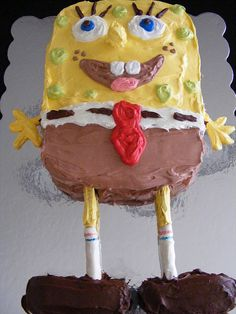

# A Full Site Build Demo of Git & Brackets

# FORKED (by MrGravy)

This is a full website build to be used in a demo of Git working with Brackets. We're probably going to cover commits, pull requests, pushes, branching, merging and other Gitty stuff. There's a picture of a Spongebob cake for no reason.

## Site contents
Pages in the build:
* index.html
* about.html
* contact.html
* intro.html

## How to use this repository
You don't, really, it's just for me.
## Contributors
Just me again.
## License
You really have no reason to use this repository unless you're me, so it's licensed to me.
